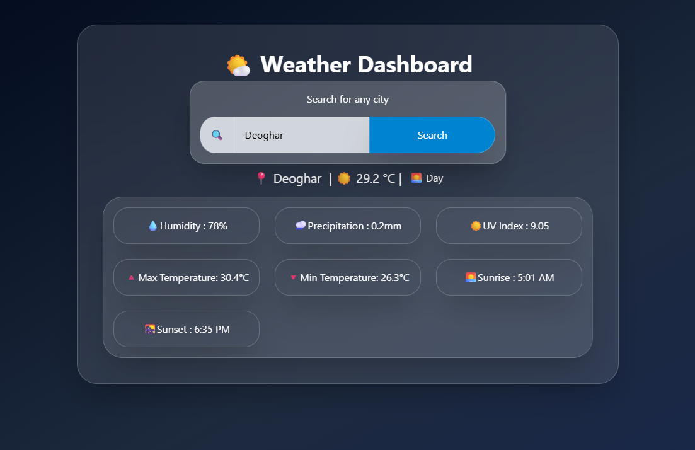

# 🌤️ Weather Dashboard

A modern and responsive weather dashboard built with **React** and **Tailwind CSS** that allows users to search for any city and view its current weather information along with today's forecast.

## 📸 Preview



.png)

```text
assets/weather-app-preview.png
```

---

## ✨ Features

- 🔍 Search weather by city name
- 🌡️ Current temperature
- 💧 Relative humidity
- 🌧️ Precipitation
- ☀️ UV Index
- 🔺 Maximum temperature
- 🔻 Minimum temperature
- 🌅 Sunrise time (12-hour format)
- 🌇 Sunset time (12-hour format)
- 🌞 Day/Night indicator
- 💾 Remembers the last searched city using Local Storage
- ⏳ Loading indicator while fetching data
- ❌ Error handling for invalid city names and network issues
- 📱 Fully responsive design
- 🎨 Glassmorphism UI with gradient background

---

## 🛠️ Built With

- React
- JavaScript (ES6+)
- Tailwind CSS
- Open-Meteo Geocoding API
- Open-Meteo Weather Forecast API

---

## 📂 Project Structure

```
src/
│
├── components/
│   ├── SearchBar.jsx
│   ├── WeatherCard.jsx
│   └── WeatherGrid.jsx
│
├── App.jsx
├── main.jsx
└── index.css
```

---

## 🚀 Getting Started

### Clone the repository

```bash
git clone https://github.com/VibhutinandSingh/Weather-App
```

### Install dependencies

```bash
npm install
```

### Start the development server

```bash
npm run dev
```

---

## 🌐 APIs Used

### Geocoding API

Used to convert a city name into latitude and longitude.

```
https://geocoding-api.open-meteo.com/
```

### Weather Forecast API

Used to fetch weather information using latitude and longitude.

```
https://api.open-meteo.com/
```

---

## 💡 What I Learned

While building this project, I practiced:

- React components
- Props
- State management with `useState`
- Side effects using `useEffect`
- Refs using `useRef`
- Fetching data from REST APIs
- Async/Await
- Conditional rendering
- Rendering lists with `.map()`
- Responsive layouts using Tailwind CSS
- Data transformation before rendering
- Local Storage
- Component-based project structure

---

## 📈 Future Improvements

- Weather icons based on weather conditions
- Search history
- 7-day weather forecast
- Temperature unit toggle (°C / °F)
- Auto-detect current location
- Better weather animations
- Dark/Light theme toggle

---

## 📄 License

This project is open source and available under the MIT License.

---

## 👨‍💻 Author

**Vibhutinand Singh**

If you liked this project, consider giving it a ⭐ on GitHub!